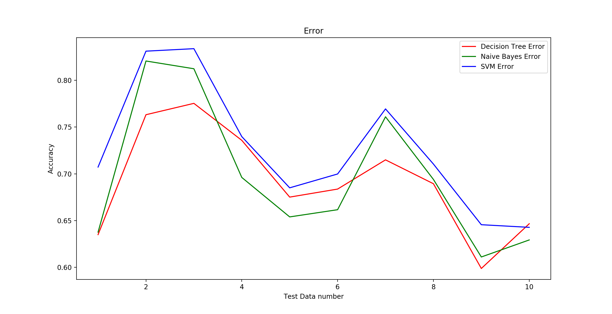

# DMML Assignment #1
#### Debjit Paria (BMC201704) & Ashwani Anand(BMC201605)####

## About the program submitted
We created the program in Python 2.7 to build three classifiers: a Decision Tree, a Naive Bayesian classifier and a Support vector machine.

We read, as input, a file *connect-4.data* in the same directory and [output](https://drive.google.com/drive/folders/1mcMzGY84QLr4d7TdxJ9biDqFqA_DIh-N?usp=sharing) the results of the k-fold test data for the Decision Tree in the file [*decision_tree.txt*](
     https://github.com/debjit99/Machine-Learning/blob/master/decision_tree.txt
    ), for the Naive Bayesian classifier in the file [*Naive_Bayes.txt*](https://drive.google.com/file/d/1pPn7Jb0F_iGmxbY0Se82apNn3i3K0rV-/view?usp=sharing), and for the Support vector machine in the file [*SVM.txt*](https://drive.google.com/file/d/1AjZnQIukR_gO1rrkimkJ0_iYPnusBSld/view?usp=sharing). We also output a [graph](https://drive.google.com/file/d/18Wmc3tAjzEkHvkcLwtl2JXOee_7kqEll/view?usp=sharing) with the accuracies of each test set in all the three classifiers.
> Win, Draw and Loss have been assigned the values 1,0 and -1 respectively in the output files.

## Libraries used
* **time**: to calulate time consumed in k-fold cross validation of each classifier.
* **numpy**: to store data in an array in numpy.array.
* **sklearn**:
    * *tree* - to build the Decision Tree Classifier.
    * *naive_bayes.MultinomialNB* - to build the Naive Bayesian Classifier.
    * *svm.LinearSVC* - to build the linear Support Vector Machine.
    * *model_selection.KFold* - to compute the 10-fold cross validation.
    * *metrics.accuracy_score* - to calculate the accuracy of the classifiers.
* **matplotlib**: to plot the accuracies of each classifier in i-th cross validation.

## Algorithm
The program reads a data file *connect-4.data* from the same directory as the program file. Then we convert the data into system understandable format using *numpy* arrays. The data is then partitioned into test and training data using the *model_selection.KFold* function. Then the required classifiers are constructed using the *DecisionTreeClassifier*, *MultinomialNB*, *LinearSVC* functions and are trained by the *fit* function. The constructed classifiers are validated by the test data by the *predict* function and accuracy is computed by the *accuracy_score* function for each cross validation. We also maintain an array of the accuracy scores to finally compute the average accuracy of the classifier.
We use *clock* function to calculate the total time consumed to construct, train, 10-fold validate, and print the output for each classifier.

Finally, a graph is plotted using *plot* function from the earlier maintained accuracy arrays.

## System used to get the output
Processor Name:	Intel Core i5  
Processor Speed:	2.7 GHz  
Number of Processors:	1  
Total Number of Cores:	2  
L2 Cache (per Core):	256 KB  
L3 Cache:	3 MB  
Memory:	8 GB  

## Accuracy, running time and memory usage
<table>
  <thead>
    <tr>
      <td rowspan=2>**Classifier**</td>
      <td rowspan=2>**Avg. Accuracy**</td>
      <td rowspan=2>**Time reqired(in sec)**</td>
      <td rowspan=2> **Memory required(in MB)**</td>
    </tr>
  <thead>
  <tbody>
    <tr>
      <td>**Decision Tree**</td>
      <td>69.17%</td>
      <td>17.65</td>
      <td>130</td>
    </tr>
    <tr>
      <td>**Naive Bayesian Classifier**</td>
      <td>69.77%</td>
      <td>14.24</td>
      <td>170</td>
    </tr>
    <tr>
      <td>**SVM**</td>
      <td>72.64%</td>
      <td>606.33</td>
      <td>200</td>
    </tr>

*Following is the accuracy graph obtained by 10-fold cross validation of all the three classifiers:*
  

  
  

